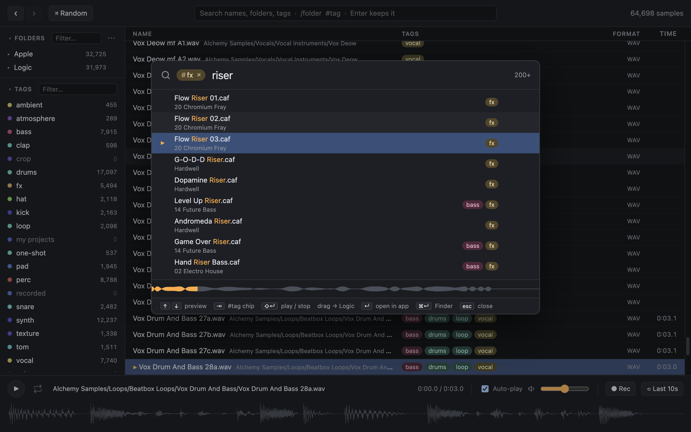
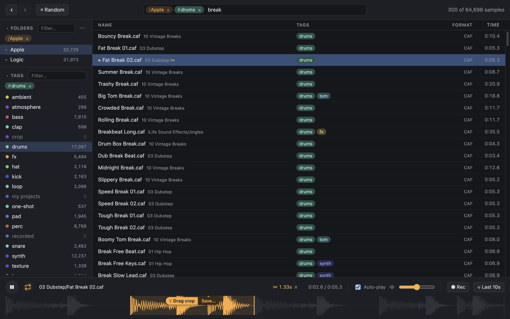
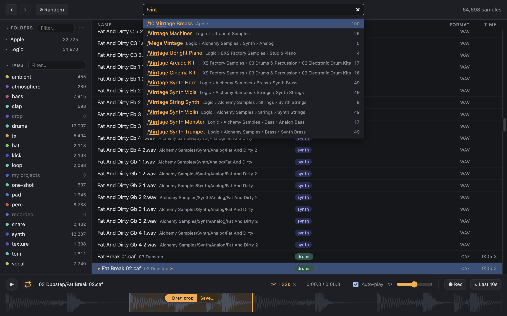
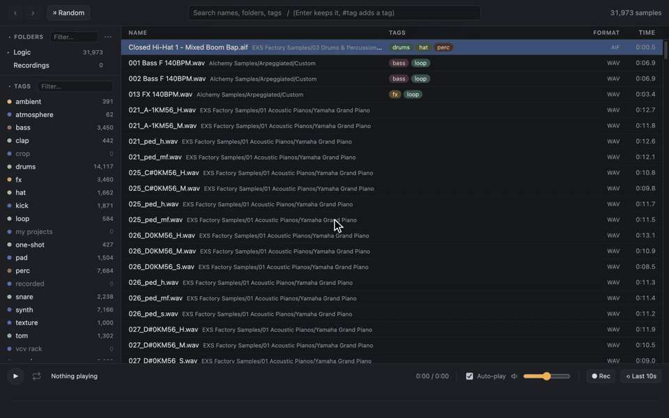

# Sample Manager

A fast, keyboard-driven sample browser for macOS. Point it at your sample folders and it indexes and tags everything, plays each sample as you arrow through the list, and lets you drag any sample — or just the part you want — straight into Logic or any other DAW.



## Features

- **Your whole library in one list.** Add any folders — Apple Loops, Logic's factory content, your own packs and bounces. New, moved and renamed files are picked up automatically.
- **Instant audition.** Arrow through the list and every sample plays as you land on it, with a waveform you can click, zoom and loop.
- **Search that ranks well.** Every word must match the name, its folders or its tags; exact names and phrases come first.
- **Filters as chips.** `/drums` picks a folder, `#bass` a tag, Enter keeps a search — all of them visible as chips you can remove with a click or Backspace.
- **Automatic tags.** Samples are tagged from their file and folder names (kick, snare, pad, vocal, fx…); edit tags by hand any time.
- **Drag to your DAW.** Drag one sample or a whole selection straight into Logic.
- **Crops.** Select part of a waveform and drag just that — no editing, no bouncing. Resize, move and loop it while it plays.
- **Kits.** Select sounds and save them together as a kit: a real folder of copies (crops included) that you can drag into Logic whole.
- **Quick Search, from anywhere.** ⌃⌥Space opens a Spotlight-style panel, even over full-screen Logic: search, audition and drag without leaving your project.
- **Rec and Last 10s.** Record what you're auditioning, or save the last ten seconds you heard after the fact.
- **Random.** One key plays a random sample from whatever you've filtered — good for breaking out of habits. ⇧R also loops a random slice of it.
- **Lives in the menu bar.** Close the window and it keeps watching your folders, with Quick Search one keystroke away.





## Demo



## Getting started

Sample Manager runs on macOS (Apple Silicon). There's no downloadable build yet — build it from source:

```sh
git clone https://github.com/vmagierski/Sample-Manager.git
cd Sample-Manager
npm install
npm run install-app   # builds the app and copies it to /Applications
```

Open **Sample Manager**, press **⌘O** to add a sample folder, and start arrowing through the list.

## Documentation

- [User guide](docs/guide.md) — searching and filters, crops, Quick Search, tags and every keyboard shortcut
- [Development](docs/development.md) — building, testing and how the code is laid out
